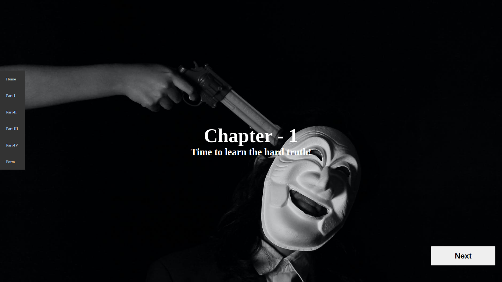
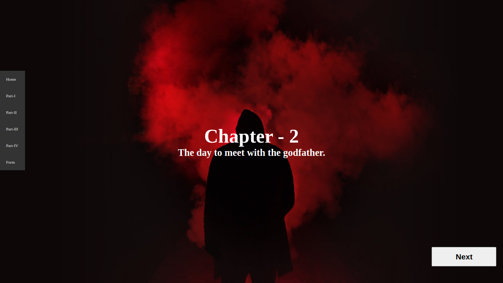
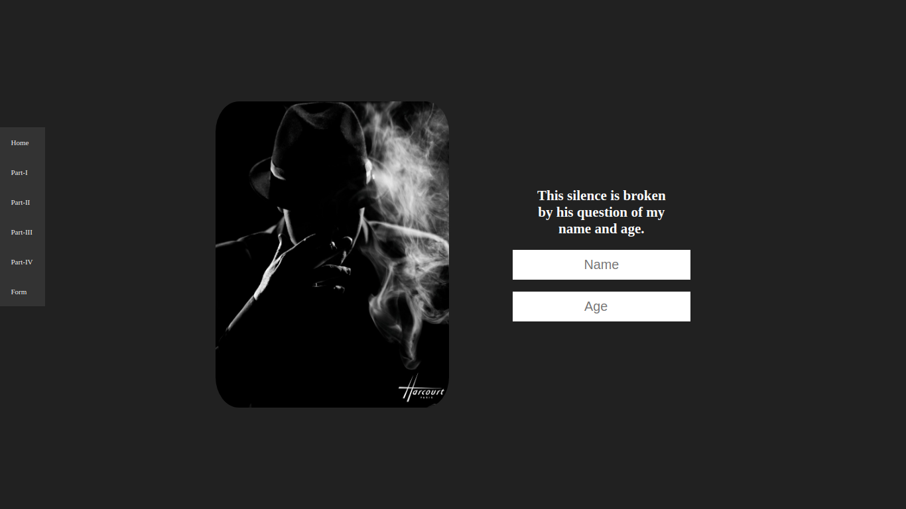
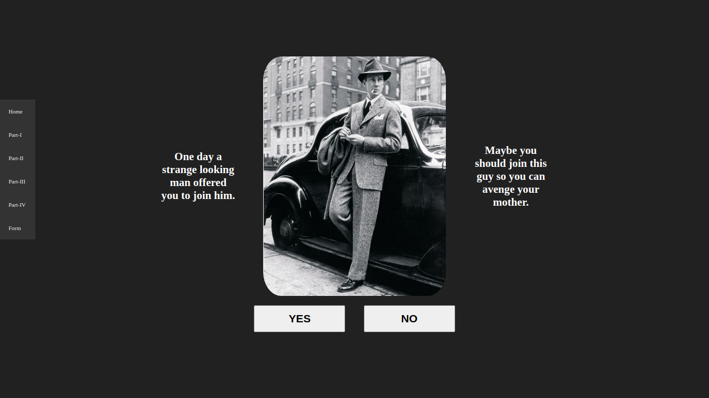
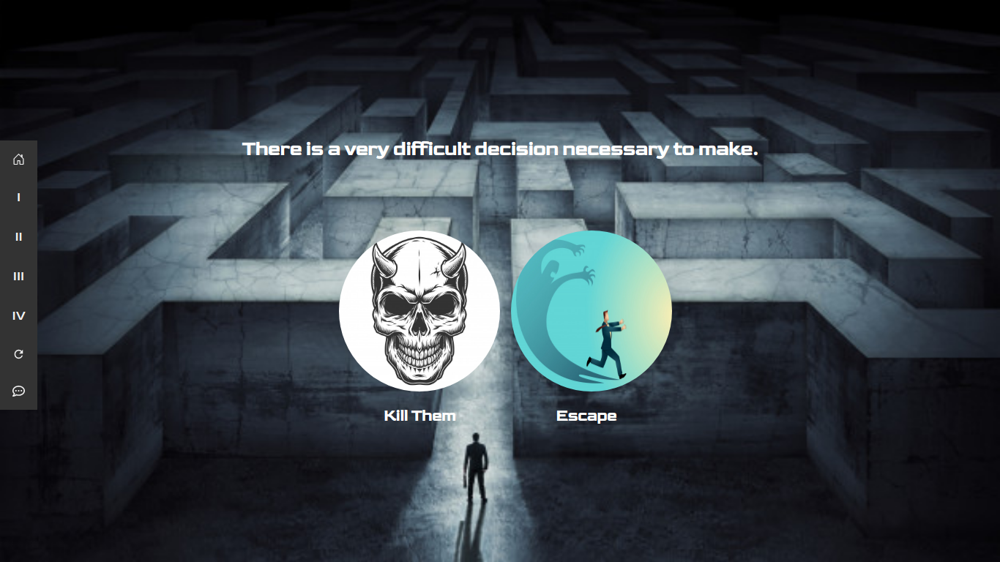
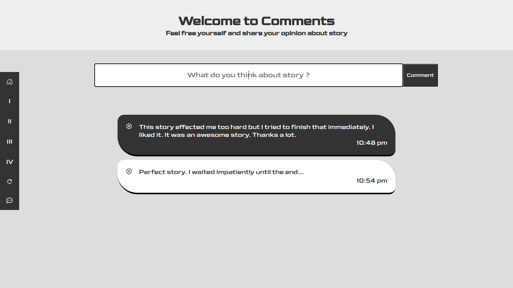

# Interactive story with ReactJS

```
Click here to see live site
```

### [Live Site](https://5fa9d5f736e9811699f54b0f--lucid-meninsky-df9762.netlify.app/)

## Introduction

-An interactive mafia story created by React.JS.
-You can select your way with your own decisions.
-I hope you enjoy in this journey!
-Also in comments part you can share your feelings about story. It was created with expressJS and mongoose..

### How to Setup:

```
- Run `npm i && npm start` for both client and server side to start the development server
- Server side uploaded to heroku so you can only start client side
```








## File Tree

```
├── client
│   ├── build
│   │   ├── asset-manifest.json
│   │   ├── favicon.ico
│   │   ├── images
│   │   │   ├── chapter-1
│   │   │   │   ├── dead-family.jpeg
│   │   │   │   ├── escape1.jpeg
│   │   │   │   ├── escape2.jpeg
│   │   │   │   ├── escape3.jpeg
│   │   │   │   ├── happy-boy.jpeg
│   │   │   │   ├── home-way.jpeg
│   │   │   │   ├── killer.jpeg
│   │   │   │   ├── offer.png
│   │   │   │   └── sleep-street.jpeg
│   │   │   ├── chapter-2
│   │   │   │   ├── bad-boys.jpeg
│   │   │   │   ├── boss1.jpeg
│   │   │   │   ├── boss2.jpeg
│   │   │   │   ├── buy-gun.jpg
│   │   │   │   ├── classic-car.jpeg
│   │   │   │   ├── escape.jpeg
│   │   │   │   ├── gun-seller.jpeg
│   │   │   │   ├── gunSeller.jpg
│   │   │   │   ├── guns.jpeg
│   │   │   │   ├── insult.jpeg
│   │   │   │   ├── kill.jpeg
│   │   │   │   ├── weapons.jpeg
│   │   │   │   └── welcome.jpeg
│   │   │   ├── chapter-3
│   │   │   │   ├── captain.jpeg
│   │   │   │   ├── enemy1.jpeg
│   │   │   │   ├── enemy2.jpeg
│   │   │   │   ├── escape.jpeg
│   │   │   │   ├── fights.jpeg
│   │   │   │   ├── gambling1.jpeg
│   │   │   │   ├── gambling2.jpeg
│   │   │   │   ├── gambling.jpeg
│   │   │   │   ├── kill.jpeg
│   │   │   │   ├── leader.jpeg
│   │   │   │   ├── lux-auto.jpeg
│   │   │   │   ├── mom1.jpeg
│   │   │   │   ├── mom2.jpeg
│   │   │   │   ├── motor.png
│   │   │   │   ├── patrol.jpeg
│   │   │   │   └── quit-street.jpeg
│   │   │   ├── chapter-4
│   │   │   │   ├── arrest.jpeg
│   │   │   │   ├── bribe1.jpeg
│   │   │   │   ├── bribe2.jpeg
│   │   │   │   ├── execution.jpeg
│   │   │   │   ├── free.jpeg
│   │   │   │   ├── jail.jpeg
│   │   │   │   ├── judge1.jpeg
│   │   │   │   ├── judge.jpeg
│   │   │   │   ├── not-regret.jpeg
│   │   │   │   ├── prison1.jpeg
│   │   │   │   ├── prison2.jpeg
│   │   │   │   ├── prison3.jpeg
│   │   │   │   ├── query.jpeg
│   │   │   │   ├── questioning.jpeg
│   │   │   │   ├── regret.jpg
│   │   │   │   └── target.jpeg
│   │   │   ├── coward.jpg
│   │   │   └── killer2.jpeg
│   │   ├── index.html
│   │   ├── logo192.png
│   │   ├── logo512.png
│   │   ├── manifest.json
│   │   ├── robots.txt
│   │   └── static
│   │       ├── css
│   │       │   ├── main.7ad35915.chunk.css
│   │       │   └── main.7ad35915.chunk.css.map
│   │       ├── js
│   │       │   ├── 2.b4f68335.chunk.js
│   │       │   ├── 2.b4f68335.chunk.js.LICENSE.txt
│   │       │   ├── 2.b4f68335.chunk.js.map
│   │       │   ├── main.4a793afe.chunk.js
│   │       │   ├── main.4a793afe.chunk.js.map
│   │       │   ├── runtime-main.86e41b17.js
│   │       │   └── runtime-main.86e41b17.js.map
│   │       └── media
│   │           ├── chapter1.95a30d75.jpeg
│   │           ├── chapter2.f91af82f.jpeg
│   │           ├── chapter3.4e632d3f.jpeg
│   │           ├── chapter4.3cc794ae.jpeg
│   │           ├── end.7eb715c0.jpeg
│   │           ├── good-feelings.e0c25616.jpeg
│   │           ├── home.d94527a7.jpeg
│   │           └── options.9395a963.jpeg
│   ├── package.json
│   ├── package-lock.json
│   ├── public
│   │   ├── favicon.ico
│   │   ├── images
│   │   │   ├── chapter-1
│   │   │   │   ├── dead-family.jpeg
│   │   │   │   ├── escape1.jpeg
│   │   │   │   ├── escape2.jpeg
│   │   │   │   ├── escape3.jpeg
│   │   │   │   ├── happy-boy.jpeg
│   │   │   │   ├── home-way.jpeg
│   │   │   │   ├── killer.jpeg
│   │   │   │   ├── no.jpg
│   │   │   │   ├── offer.png
│   │   │   │   ├── sleep-street.jpeg
│   │   │   │   └── yes.jpg
│   │   │   ├── chapter-2
│   │   │   │   ├── bad-boys.jpeg
│   │   │   │   ├── boss1.jpeg
│   │   │   │   ├── boss2.jpeg
│   │   │   │   ├── buy-gun.jpg
│   │   │   │   ├── classic-car.jpeg
│   │   │   │   ├── escape.jpeg
│   │   │   │   ├── gun-seller.jpeg
│   │   │   │   ├── gunSeller.jpg
│   │   │   │   ├── guns.jpeg
│   │   │   │   ├── insult.jpeg
│   │   │   │   ├── kill.jpeg
│   │   │   │   ├── weapons.jpeg
│   │   │   │   └── welcome.jpeg
│   │   │   ├── chapter-3
│   │   │   │   ├── captain.jpeg
│   │   │   │   ├── enemy1.jpeg
│   │   │   │   ├── enemy2.jpeg
│   │   │   │   ├── escape.jpeg
│   │   │   │   ├── fights.jpeg
│   │   │   │   ├── gambling1.jpeg
│   │   │   │   ├── gambling2.jpeg
│   │   │   │   ├── gambling.jpeg
│   │   │   │   ├── kill.jpeg
│   │   │   │   ├── leader.jpeg
│   │   │   │   ├── lux-auto.jpeg
│   │   │   │   ├── mom1.jpeg
│   │   │   │   ├── mom2.jpeg
│   │   │   │   ├── motor.png
│   │   │   │   ├── patrol.jpeg
│   │   │   │   └── quit-street.jpeg
│   │   │   ├── chapter-4
│   │   │   │   ├── arrest.jpeg
│   │   │   │   ├── bribe1.jpeg
│   │   │   │   ├── bribe2.jpeg
│   │   │   │   ├── execution.jpeg
│   │   │   │   ├── free.jpeg
│   │   │   │   ├── jail.jpeg
│   │   │   │   ├── judge1.jpeg
│   │   │   │   ├── judge.jpeg
│   │   │   │   ├── not-regret.jpeg
│   │   │   │   ├── prison1.jpeg
│   │   │   │   ├── prison2.jpeg
│   │   │   │   ├── prison3.jpeg
│   │   │   │   ├── query.jpeg
│   │   │   │   ├── questioning.jpeg
│   │   │   │   ├── regret.jpg
│   │   │   │   └── target.jpeg
│   │   │   ├── coward.jpg
│   │   │   └── killer2.jpeg
│   │   ├── index.html
│   │   ├── logo192.png
│   │   ├── logo512.png
│   │   ├── manifest.json
│   │   └── robots.txt
│   └── src
│       ├── App.css
│       ├── App.js
│       ├── bg-images
│       │   ├── chapter1.jpeg
│       │   ├── chapter2.jpeg
│       │   ├── chapter3.jpeg
│       │   ├── chapter4.jpeg
│       │   ├── end.jpeg
│       │   ├── good-feelings.jpeg
│       │   ├── home.jpeg
│       │   └── options.jpeg
│       ├── components
│       │   ├── Chapter.js
│       │   ├── CommentFormInput.js
│       │   ├── Comment.js
│       │   ├── Direction.js
│       │   ├── FollowStory.js
│       │   ├── Form.js
│       │   ├── GoHome.js
│       │   ├── Home.js
│       │   ├── NavBar.js
│       │   └── OpenContext.js
│       ├── index.js
│       └── pages
│           ├── chapter1
│           │   ├── Chapter1.js
│           │   ├── Escape.js
│           │   ├── Execution.js
│           │   ├── HomeWay.js
│           │   ├── Killer.js
│           │   ├── Offer.js
│           │   └── SleepStreet.js
│           ├── chapter2
│           │   ├── BuyYourGun.js
│           │   ├── Chapter2.js
│           │   ├── DoYouHaveMoney.js
│           │   ├── GoSeller.js
│           │   ├── Insult.js
│           │   ├── KillOrForgive.js
│           │   ├── MeetFather.js
│           │   ├── SelectGun.js
│           │   ├── SpeakWithSeller.js
│           │   ├── TeamMembers.js
│           │   ├── TellYourName.js
│           │   └── TooYoung.js
│           ├── chapter3
│           │   ├── Chapter3.js
│           │   ├── GoodFeelings.js
│           │   ├── Intelligence.js
│           │   ├── Leader.js
│           │   ├── LuxHabits.js
│           │   ├── NewLife.js
│           │   ├── QuietStreet.js
│           │   ├── RememberMom.js
│           │   └── Revenge.js
│           └── chapter4
│               ├── Arrest.js
│               ├── Bribe.js
│               ├── Chapter4.js
│               ├── DeadEnd.js
│               ├── Defense.js
│               ├── GodFather.js
│               ├── HardPunishment.js
│               ├── KingOfJail.js
│               ├── Prosecution.js
│               ├── ReducedPenalty.js
│               ├── TheEnd.js
│               └── ThinkAboutJudge.js
├── images
│   ├── chapter.png
│   ├── decision.png
│   ├── home.png
│   └── option.png
├── README.md
└── server
    ├── controllers
    │   └── commentController.js
    ├── models
    │   └── Comment.js
    ├── package.json
    ├── package-lock.json
    ├── Procfile
    ├── routes
    │   └── commentRouter.js
    ├── server.js
    └── util.js
        └── connectDB.js
```
